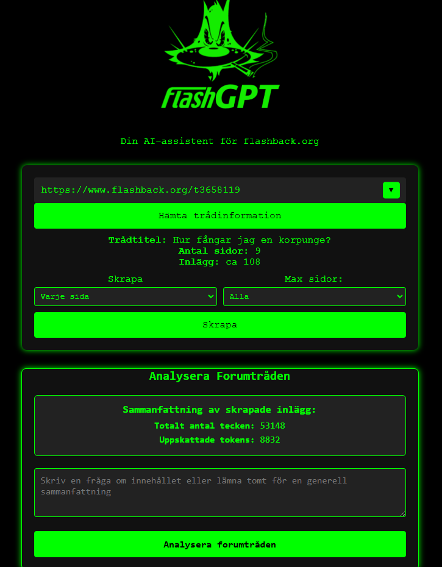
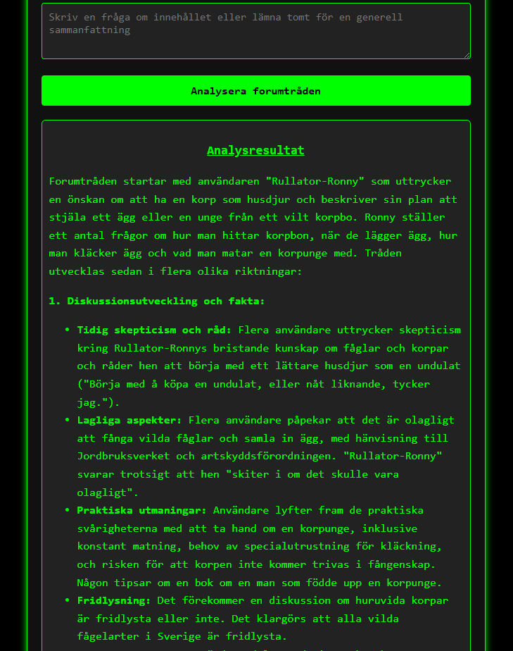

# FlashGPT - Din AI-assistent för flashback.org





**FlashGPT** är ett verktyg för att snabbt analysera och sammanfatta forumtrådar på **Flashback**. Istället för att manuellt plöja igenom hundratals inlägg kan du skrapa trådar och få en sammanfattning direkt. Perfekt för att snabbt få en överblick över heta diskussioner.

## 🚀 Funktioner

- **🔍 Skrapa valfria Flashback-trådar** – Ange en URL och få en sammanfattning.
- **🔥 Populära trådar** – Få en lista över de mest aktiva trådarna just nu.
- **🤖 AI-analys** – Använder **OpenAI** och **Gemini** för att generera sammanfattningar.
- **⚡ Snabb & effektiv** – Slipp läsa 1000+ inlägg, få kärnan direkt.

## 📦 Installation & Körning

### 1️⃣ Klona repot
```sh
git clone https://github.com/elfgren89/FlashGPT.git
cd FlashGPT
```

### 2️⃣ Lägg till API-nycklar i `.env`
Skapa en `.env`-fil i `backend/` baserat på `.env.example` och fyll i dina egna API-nycklar för OpenAI och Gemini.

```env
OPENAI_API_KEY=din_openai_nyckel
GEMINI_API_KEY=din_gemini_nyckel
```

### 3️⃣ Bygg & starta med Docker
Om du använder Docker:

Bygg backend- och frontend-images:
```sh
docker build -t flashgpt-backend -f backend/Dockerfile backend/
docker build -t flashgpt-frontend -f frontend/Dockerfile frontend/
```

Starta med Docker Compose:
```sh
docker-compose -p flashgpt up -d --build
```
Detta startar både **backend** och **frontend** i separata containrar.

### 4️⃣ Kör manuellt (utan Docker)
Om du vill köra direkt på din dator:

#### 🖥️ Backend
```sh
cd backend
npm install
node server.js
```

#### 🎨 Frontend
```sh
cd frontend
npm install
npm start
```

### 5️⃣ Öppna i webbläsaren
- **Frontend** körs på: [http://localhost:3000](http://localhost:3000)
- **Backend** körs på: [http://localhost:5000](http://localhost:5000)

---

## 🛠️ Teknisk översikt

| Komponent   | Teknologi |
|-------------|----------|
| **Frontend**  | React, Serve (för statiska filer) |
| **Backend**   | Node.js, Express, Cheerio (för web scraping) |
| **Datakällor** | Flashback.org |
| **AI-modeller** | OpenAI GPT & Gemini |

---